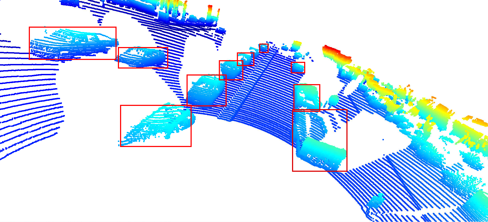

# Project 1: 3D Object Detection

In this project vehicles were detected from a 3D point cloud. An image from one from of the point cloud is shown below. 

Multiple vehicles can be seen in this image, 10 are highlighted with red rectangles. 
On most vehicles, wheel wells windows and side view mirrors can be seen. The wheels themselves, as well as head and tail lights and bumpers are also visible when those parts of the vehicle are not obscured. 
